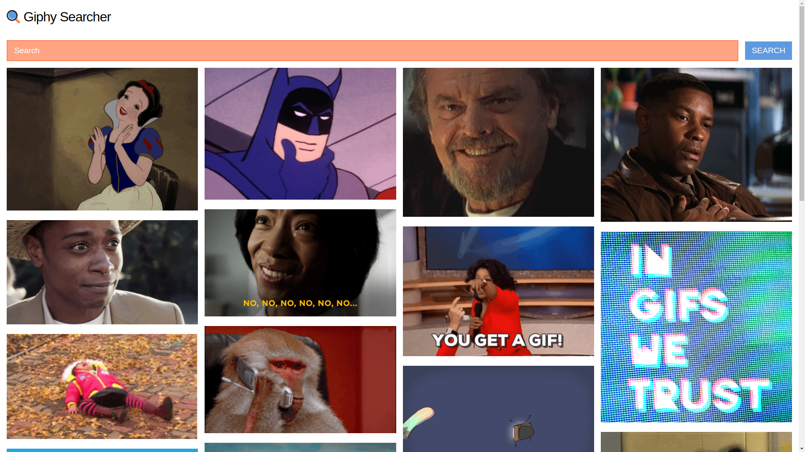

# React Giphy Searcher
<p align="center"></p>

## Project Concept
We are going to build a searchable interface for the [Giphy API](https://developers.giphy.com/) using React. This will be a multi-day deliverable, with each part including a new React stack concept we learn in class.

Here's what we need for our MVP:
- [ ] Style the site with [Tailwind CSS](https://tailwindcss.com/)
- [ ] Connect our application to the API
- [ ] Load gifs into a gallery when our application loads
- [ ] Display all gifs from the [trending endpoint](https://developers.giphy.com/docs/api/endpoint/#trending) on component mount
- [ ] When a gif is clicked on, display a details page that shows more information about that gif, such as the gif's creator
- [ ] Create a search bar that will search for gifs depending on what is searched and display the results in the gallery. This search bar will use the [search endpoint](https://developers.giphy.com/docs/api/endpoint/#search)


## Project Set Up
### Sign up for an API key
Before starting this project, you'll need to go to the [Giphy Developers site](https://developers.giphy.com/docs/api/) and obtain an API key.
1.  Create an account and sign in.
1.  Set up an app by clicking the Create App in the navbar to obtain your beta key.

### Test Out Your API Key in Postman
1. Open Postman and create a new collection called *React Giphy Searcher*
1. Add a new GET request to the collection and test out the [trending endpoint](https://developers.giphy.com/docs/api/endpoint/#trending) to make sure your key is working.
1. Add another new GET request to the collection and test out the [search endpoint](https://developers.giphy.com/docs/api/endpoint/#trending).

### Scaffold Your Project
1. Fork and clone this repo
1. Using Vite, create a React app called `react-giphy searcher` with Tailwind CSS by following [this guide](https://tailwindcss.com/docs/guides/vite)
1. Remove all the unnecessary SVG files
1. Create a `components` folder inside `src`
1. Inside the `components` folder, create another folder called `App`
1. Move `App.jsx` into the `src/components/App` folder and rename `App.jsx` to `index.jsx`
1. Move `App.css` into the `src/components/App` folder and rename `App.css` to `styles.
1. You file structure should look like this:
    ```
    aesthetic-domain
    ├── node_modules/
    ├── public/
    └── src
    │   ├── assets/
    │   ├── components/
    │   │   ├── App
    │   │   │   ├── index.jsx
    │   │   │   └── styles.css
    │   ├── index.css
    │   └── main.jsx
    ├── .gitignore
    ├── index.html
    ├── package.json
    ├── package-lock.json
    ├── postcss.config.js
    ├── tailwind.config.js
    └── vite.config.js
    ```
1. Update your component and CSS imports to reflect these changes
1. Replace the code in `App.jsx` with the following:
    ```jsx
    function App() {
      return (
        <div>
          <h1>React Giphy Searcher</h1>
        </div>
      );
    }

    export default App;
    ```

### Store your API Key Securely
As developers, we need to guard against our API keys being pushed to GitHub. One way to ensure that this doesn't happen is to store them in a separate file that is not tracked in Git at all.

As we have done before, we will create a `.env` file to store the API key.

1. Create a new file in the project root directory called `.env`
1. Inside this file add the following, replacing where it reads `Your API Key Goes Here` with your Giphy API key:
```bash
VITE_GIPHY_KEY='Your API Key Goes Here'
```

Vite automatically loads environment variables, and exposes variables prefixed with `VITE_` to the React app. This means that _if your server is already running_, you need to stop it and restart it after adding or changing an environment variable, so do that now.

You can access the environemnt variable in a React component like this using this syntax:
`import.meta.env.VITE_SOME_KEY`

You can `console.log` it in a component to see if your environemtn is set up correctly.
```jsx
function App() {
  console.log(import.meta.env.VITE_GIPHY_KEY)
  return (
    <div>
      <h1>React Giphy Searcher</h1>
    </div>
  );
}

export default App;
```

## Structuring Your React App
Currently your application file structure matches what's outlined above. ***We recommend you build your app with the same file structure as what we've built in class.***

However, there is no one correct way to build a React application. You can read [this article](https://david-gilbertson.medium.com/the-100-correct-way-to-structure-a-react-app-or-why-theres-no-such-thing-3ede534ef1ed) for more information on why there's no one true way. 

Ultimately, you will be in control of what components you make, how you name them, and where you store them. Ensure however, that you are observing a consistent separation of concerns.


## Deliverable Part 1
For this deliverable you'll be building something similar to what we've done in Aesthetic Domain parts 1-3. 

### Requirements
- Create a landing page that displays 50 trending gif images from the *Trending* API endpoint.
    - Consider how you might implement the `useEffect` hook to query the API
    - Consider how you might implement the `useState` hook to store the API response.
- When you click on a gif, render a "details page". This will not be separate page yet, but rather appear as HTML at the bottom of the landing page.
    - This page should display: 
        - The gif image
        - The gif title
        - The user (the gif creator)'s avatar, username, and link to their Giphy profile
- Your landing page should be styled with Tailwind CSS.

Here's a possible mockup depicting what the landing page could look like:



(If you build a search bar like in the image above, it does not need to be functional yet)

### Hungry for More
- On your landing page, display 10 gifs and build out pagination functionality so that you can view 10 new gifs each time you paginate forwards or backwards.
